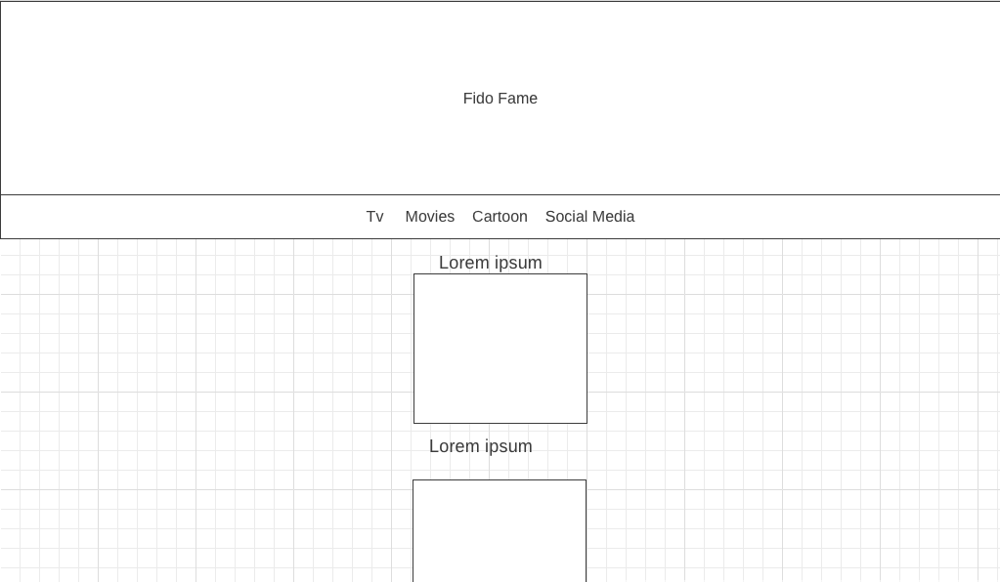
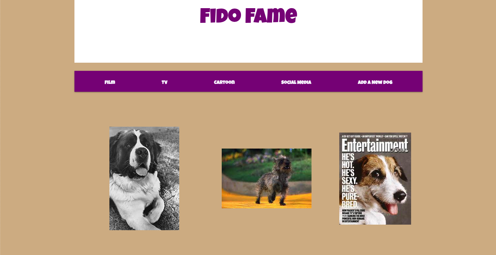
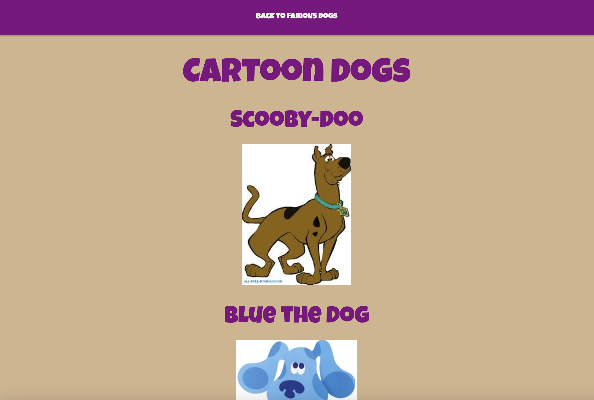

# FidoFame

A full CRUD application that displays information about Famous Dogs  using the MongoDB.

## Technologies Used

javascript
HTML5
CSS

## Libraries
body-parser
dotenv
ejs
express
materialize-css
method-override
mongoose
nodemon

##Routes

| Verb        | Path          | Action  | Used for    |
| ----------- | -----------   | --------| ----------- |
| GET         | /fidofame     | index   | Homepage    |
| GET         | /fidofame/new | new     | Displays a space for users to add new dogs |
| DELETE      | /fidofame/:id | delete  | Deletes a dog and redirects to index page
| PUT         | /fidofame/:id | update  | Updates dog info. and redirects to show |
| POST        | /fidofame     | create  | Adds new dogs to the database |
| GET         | /fidofame/:id/edit | edit| Displays a space for users to update infomation about a dog  |
| GET         | /fidofame/:id | show     | Displays information about individual dog |

##Model: Fido
| name | image   | breed | renown | description | deceased |
| ----------- | -----------   | --------| ----------- | ----------- | ----------- |
| ex: Terry | data:image/jpeg | Cairn Terrier | film | In the Wizard of Oz | True

## Wireframes

## Screenshots

## Getting Started

https://fidofame.herokuapp.com/fidofame

## Next Steps

- More dog categories ex. Show Dogs
- Better css on Home Page
- Media Queries to Work with Phones